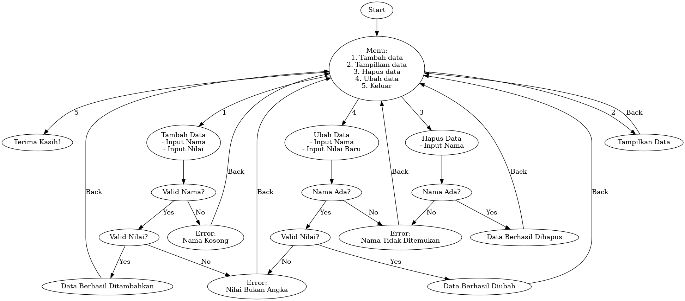
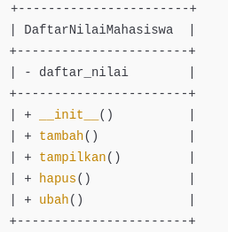
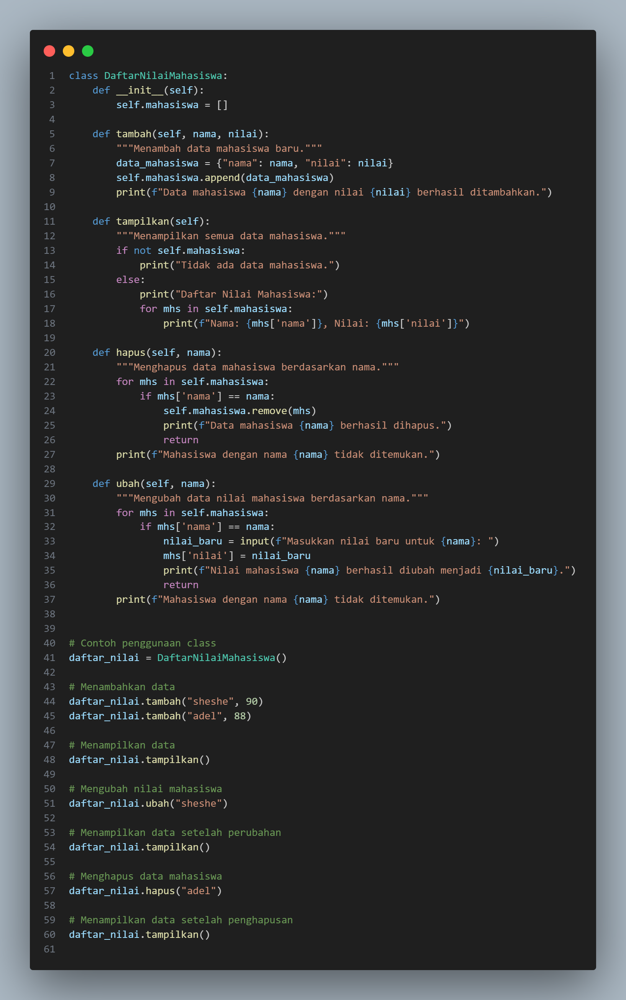
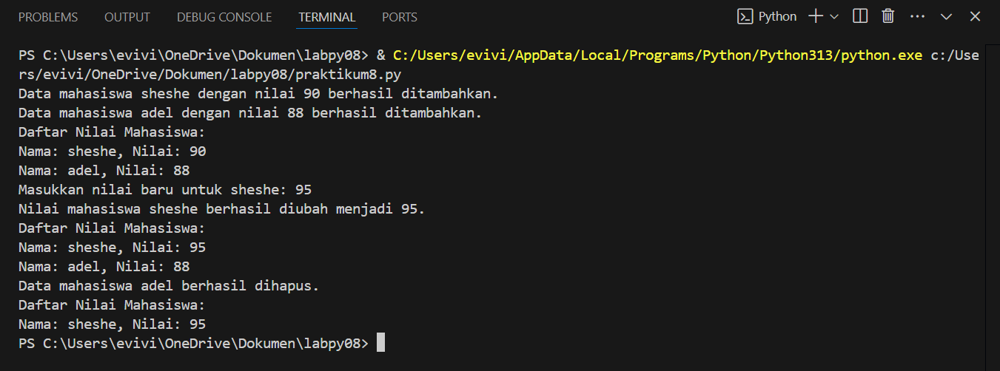

# TUGAS PRAKTIKUM 8
# Data Diri

Nama : She she metahanover 

NIM : 312410432

Kelas : TI,24.A.3

# Flowchart 

# diagram class

# input dan outpu dari Praktikum 8

## 1. input tambah data 

## outpu tambah data 

1. Metode __init__():
   - Inisialisasi kelas dengan membuat list kosong student_grades untuk menyimpan data mahasiswa

2. Metode tambah(nama, nilai):
   - Menambahkan data mahasiswa baru ke dalam list
   - Menerima parameter nama dan nilai mahasiswa
   - Menambahkan data sebagai dictionary ke nilai mahasiswa 
   - Mencetak pesan konfirmasi penambahan data

3. Metode tampilkan():
   - Menampilkan seluruh daftar mahasiswa
   - Jika list kosong, mencetak pesan "Tidak ada data mahasiswa"
   - Jika ada data, mencetak nama dan nilai setiap mahasiswa

4. Metode hapus(nama):
   - Menghapus data mahasiswa berdasarkan nama
   - Mencari mahasiswa dengan nama yang sesuai
   - Jika ditemukan, menghapus data dan mencetak konfirmasi
   - Jika tidak ditemukan, mencetak pesan bahwa data tidak ada

5. Metode ubah(nama, nilai baru):
   - Mengubah nilai mahasiswa berdasarkan nama
   - Mencari mahasiswa dengan nama yang sesuai
   - Jika ditemukan, mengupdate nilai dan mencetak konfirmasi perubahan
   - Jika tidak ditemukan, mencetak pesan bahwa data tidak ada

Contoh penggunaan di akhir code menunjukkan:
- Membuat objek daftar_nilai
- Menambahkan dua mahasiswa
- Menampilkan daftar
- Mengubah nilai sheshe
- Menghapus adel
- Menampilkan daftar terakhir